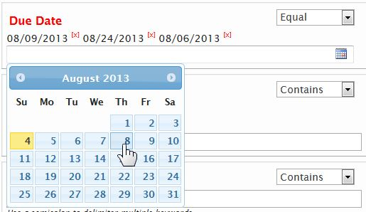

SPDateField Widget
====================

SPDateField is a widgets wrapped around [jQuery UI's Datepicker][jqueryuidatepicker] that allows the user to pick one or more dates using their own locale format, while storing the SharePoint friendly format (YYY-MM-DD) in the input field to which this widget was bound to. In addition to wrapping the jQuery UI's datepicker, this widget also provide a timepicker which in turn returns both the date and time in the date format used by SharePoint ([ISO 8601][iso8601])

Below is a screen capture of this widget's being used in a Filter Panel: 

SPDateField widget was introduced with v2.2

Usage
-----

    $("input[name='DueDate']").SPDateField();

   

Input Parameters
----------------

This method takes as input an object containing the supported options:

        $("#listFilter").SPDateField({
            allowMultiples: false,
            delimeter:      ";",
            remainOpen:     true,
            datepicker:     {
                dateFormat:         'mm/dd/yy',
                buttonImage:        '/_layouts/images/CALENDAR.GIF',
                showOn:             "both",
                buttonImageOnly:    true
            },
            dateTemplate: '{{date}} &lt;span class="spwidgets-item-remove"&gt;[x]&lt;/span&gt;',
            showTimepicker: false,
            timeFormat:     ' {{hour}}:{{minutes}} {{ampm}}',
            timeUTC:        true,
            labelHour:      'Hour',
            labelMinutes:   'Minutes',
            labelAMPM:      'AM|PM',
            labelTime:      'Time',
            labelSet:       'Set'
        });

All input options are optional. The default options for this widget can be manipulated/set via the following object:

        $.SPWidgets.defaults.date = {}

### Options

-   **allowMultiples**    :   *Boolean. Optional. Default: false*  
    Whether to allow the definition of multiple dates. When set to _true_, dates selected are stored in the input field using the _delimeter_ (option below). 

-   **delimeter**    :   *String. Optional. Default: ";"*  
    Used when _allowMultiples_ is set to true. Defines the delimetered to be used when storing and parsing dates.

-   **remainOpen**    :   *Boolean. Optional. Default: true*  
    Used when _allowMultiples_ is set to true. It will leave the Datepicker open after the user picks a date, thus allowing a quick method for selecting multiples. 

-   **datepicker**    :   *Object. Optional. Default: {...}*  
    The [Datepicker][jqueryuidatepicker] options for the widget. Nearly all options supported by jQuery UI Datepicker widget can be defined with the exception of _altField_ and _altFormat_. Also, note that when _allowMultiples_ option is set to true, the _showAnim_ Datepicker option will also not be overridden.
    
    The following Datepicker options are set by default:
    
    1.  dateFormat = mm/dd/yy
    2.  buttonImage = /_layouts/images/CALENDAR.GIF
    3.  showOn = both
    4.  buttonImageOnly = true

-   **dateTemplate**    :   *String. Optional. Default:...*  
    Used only when _allowMultiples_ is set to true. The template to be used for displayed the dates that the user selected. Default template is:
    
        {{date}} [x]

    The template is rendered using SPWidgets _$.SPWidgets.fillTemplate_ utility and given an object with one property, _date_, which can be used in the defined template. The date is formatted according to _dateFormat_ defined with the _datepicker_ options. When defining a template, an html element with a class of _spwidgets-item-remove_ can be used to provide the user with the means to remove a date from the selection.
    
    See section titled _Allow Multiples Display_ for more information on how dates are displayed on the UI, case further manipulation is desired.

-   **showTimepicker**    :   *Boolean. Optional. Default: false 
    If set to true, then a datepicker along with a timepicker will be displayed for user to select both. Note that when the timepicker is used, the time selected will be appended to the date string provided by the jQuery datepicker when displayed. 
    
    **NOTE:** The time picker is not as robust as the jQuery Datepicker widget. As an example, if user chooses to not use the picker and opts to type in the date and time manually, this widget will be able to parse that input.  When showTimePicker is set to _true_ the used of the picker widget is assumed. 

-   **timeFormat**    :   *String. Optional. Default: ' {{hour}}:{{minutes}} {{ampm}}' 
    Used when _showTimepicker_ is set to _true_. The format that the date should be displayed with. The time string defined here will be displayed on the widget following the date selected. The following tokens can be used to define the display format:
    
    _{{hour}}_ 
    The token will be replaced with the digit(s) representing the hour selected (ex. 4 for 4PM).
    
    _{{hour24}}_ 
    The token will be replaced with the digits(s) representing the hour in 24h format (ex. 16 for 4PM).
    
    _{{minutes}}_ 
    The token will be replaced with the digits representing the minutes (ex. 05 for 5 minutes).
    
    _{{ampm}}_ 
    The token will be replaced with the words letters _AM_ or _PM_ depending on what time was selected.

    Example:
    
        timeFormat: ' at {{minutes}} past {{hour}}{{ampm}}'

-   **timeUTC**    :   *Boolean. Optional. Default: true 
    Used when _showTimepicker_ is set to _true_. Option affects the format of the date string generated (not the visible date and time). When set to true, a UTC compliant date and time string will be generated. Setting this to false, will generate a date in user's local time.
    
-   **labelHour**    :   *String. Optional. Default: 'Hour' 
    Used when _showTimepicker_ is set to _true_. The label to be displayed next to the Hour select dropdown. 

-   **labelMinutes**    :   *String. Optional. Default: 'Minutes' 
    Used when _showTimepicker_ is set to _true_. The label to be displayed next to the Minutes select dropdown.

-   **labelAMPM**    :   *String. Optional. Default: 'AM|PM' 
    Used when _showTimepicker_ is set to _true_. The label to be displayed next to the AM, PM select dropdown.

-   **labelTime**    :   *String. Optional. Default: 'Time' 
    Used when _showTimepicker_ is set to _true_. The label to be shown at the top of the timepicker section.

-   **labelSet**    :   *String. Optional. Default: 'Time' 
    Used when _showTimepicker_ and _allowMultiples_ are both set to _true_. The label of the button displayed on the widget to set a date time combination.

Return Value
------------

This plugin will return a jQuery object that contains the initially selected set of nodes (selector), thus maintaining chainability.

Methods
-------

-   **reset()** 
    The reset method erases any dates defined on the input.
    
    **Usage:**
    
        $("input[name='DueDate']").SPDateField("reset");
    
    **Input**
    
    None.
    
    **Return Value:**
    
    This method returns a JQuery object with the initial selections, thus maintaining jQuery's chainability.     

-   **getDate()** 
    Returns an object with the dates currently set on the widget.
    
    **Usage:**
    
        $("input[name='DueDate']").SPDateField("getDate");
    
    **Input**
    
    None.
    
    **Return Value:**
    
    This method returns an object with the following structure (example below shows response when _allowMultiples_ is set to _true_:
    
        {
            input: '2013-08-01;2013-08-02',
            dates: [
                '2013-08-01',
                '2013-08-02'
            ]
        }
    
    Dates are provided in the SharePoint format: yyyy-mm-dd.

-   **setDate([dates], "format")** 
    Sets one or more dates on the widget. 
    
    **Usage:**
    
        $("input[name='DueDate']")
            .SPDateField(
                "setDate",
                [
                    "08/02/2013",
                    (new Date("2013", "7", "1"))
                ],
                "mm/dd/yy"
            );
    
    **Input**
    
    _{Array|Date|String} dates_ 
    Dates can be defined either as a string (ex. _08/01/2013_) or as a JavaScript Date Object.  This input parameter can be either a single value or an array of values to be set.
        
    When _showTimepicker_ option is _true_, if providing the dates as a string, they must be defined in the SharePoint internal format [ISO 8601][iso8601] (ex. 2013-09-05T0600Z).    
    
    _{String} format_ 
    Used only when dates are defined as a string and _showTimepicker_ option is _false_. The format of the dates defined. Used with jQuery UI Datepicker _parseDate_ utiltiy. For more information on the format definition, see the [jQuery UI Datepicker][jqueryuidatepicker] widget documentation. 
    
    **Return Value:**
    
    This method returns a JQuery object with the initial selections, thus maintaining jQuery's chainability.     
    

-   **removeDate(dates[], "format")** 
    Removes one or more dates from the Widget. 
    
    **Usage:**
    
        $("input[name='DueDate']")
            .SPDateField(
                "removeDate",
                [
                    "08/02/2013",
                    (new Date("2013", "7", "1"))
                ],
                "mm/dd/yy"
            );
    
    **Input**
    
    _{Array|Date|String} dates_ 
    Dates can be defined either as a string (ex. _08/01/2013_) or as a JavaScript Date Object.  This input parameter can be either a single value or an array of values to be set.
        
    When _showTimepicker_ option is _true_, if providing the dates as a string, they must be defined in the SharePoint internal format [ISO 8601][iso8601] (ex. 2013-09-05T0600Z).    
    
    _{String} format_ 
    Used only when dates are defined as a string and _showTimepicker_ option is _false_. The format of the dates defined. Used with jQuery UI Datepicker _parseDate_ utiltiy. For more information on the format definition, see the [jQuery UI Datepicker][jqueryuidatepicker] widget documentation.
    
    **Return Value:**
    
    This method returns a JQuery object with the initial selections, thus maintaining jQuery's chainability.     

-   **destroy()** 
    Removes the SPDateWidget from the bound element. Note that any dates stored on the input element will not be removed.
    
    **Usage:**
    
        $("input[name='DueDate']").SPDateField("destroy")
    
    **Input**
    
    None.
    
    **Return Value:**
    
    This method returns a JQuery object with the initial selections, thus maintaining jQuery's chainability.     

Events
------

This widgets does not have any custom events. The input field used to bind this widget to, however, will trigger _change_ events everytime a date is added or removed from it.

Allow Multiples Display
-----------------------

When _allowMultiples_ is set to true, the dates selected by the user will be displayed using the _dateTemplate_ value. That template is wrapped in a _&lt;span&gt;_ element with a css class of _spwidgets-item_. The example below shows the rendred markup of a date using the default _dateTemplate_ definition:

    
        08/01/2013[x] 
     

Examples
--------

### Example 1 - Allow multiple dates

    $("input[name='DueDate']").SPDateField({
        allowMultiples: true
    });

### Example 2 - Define date to Euro format

    $("input[name='DueDate']").SPDateField({
        datepicker: {
            dateFormat: "dd/mm/yy"
        }
    });

[jqueryuidatepicker]: http://api.jqueryui.com/datepicker/   "jQuery UI Datepicker"
[iso8601]: http://en.wikipedia.org/wiki/ISO_8601 "ISO 8601"
